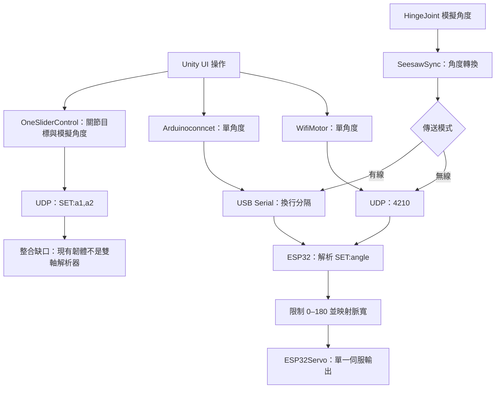
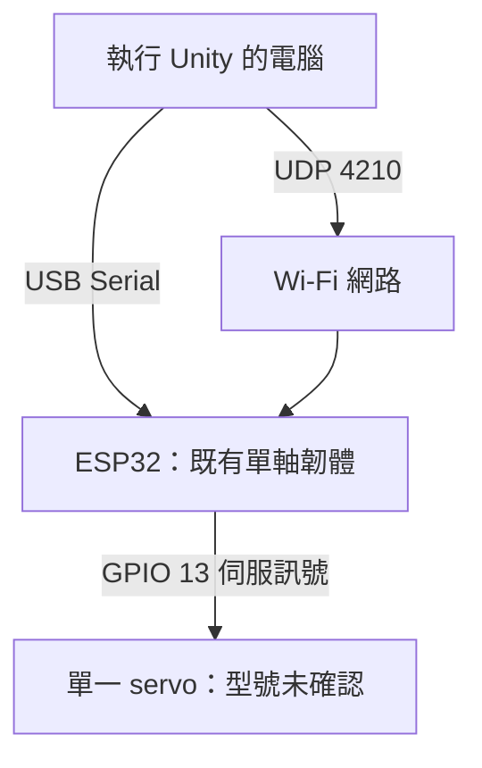

# 虛實整合裝置：實作架構與進度

> 用途：2026/10/14 論文提報「實作進度」章節。文件核對日期：2026/09/30。
> 程式依據：`main` 在核對時的 commit [`6ee19c22133b231079cf3abc5bbffb982b1496b4`](https://github.com/ZhengTsuHao/Virtual-Real-Integration-Device/commit/6ee19c22133b231079cf3abc5bbffb982b1496b4)，commit 日期為 2026/02/02。Commit 日期不等同遠端最後 push 時間。
> 本文件是原始碼與場景的靜態盤點，未執行 Unity、編譯韌體或測試實體硬體。程式存在不代表端到端測試成功。

## 1. 提報可用的實作說明

本研究目前以既有 Unity 蹺蹺板測試專案作為虛實連動的程式基礎。專案包含 UI 角度操作、HingeJoint 物理角度讀取，以及透過 UDP 或 USB Serial 發送角度指令的程式；ESP32 韌體則接收單一角度指令並輸出伺服控制訊號。現階段可以確認上述控制邏輯已存在於 repository，但尚未由本次盤點驗證實體執行結果。

後續作品方向為搭載螢幕與攝影機的機械手臂，預期依觀眾位置產生轉向與互動。已持有的實作設備為 Mac、ESP32-S3、RDS5160 伺服、ZL-KPZ2 24 路伺服控制板及 Logitech C270。這組硬體與既有程式的相容性、控制板通訊、攝影機追蹤及完整手臂控制仍待測試與開發；目前不能宣稱已完成觀眾追蹤或完整虛實同步機械手臂。

## 2. 狀態定義與盤點

| 狀態 | 判定依據 | 提報使用方式 |
|---|---|---|
| repo 已存在 | 在上述 commit 的檔案或場景中可直接確認 | 說明「已建置程式／場景」，不等同測試通過 |
| 實體已持有／待測 | 研究者於 2026/09/30 確認持有，未提供此組合的測試結果 | 說明設備準備情形與待驗證項目 |
| 規劃中 | 作品目標或後續開發項目，尚無對應完成證據 | 使用「預期／將開發／待驗證」，不列為完成 |

| 項目 | 狀態 | 已確認內容與限制 |
|---|---|---|
| Unity 專案 | repo 已存在 | `ProjectVersion.txt` 記錄 Unity 2022.3.62f3；本次未啟動或編譯 |
| 蹺蹺板測試場景 | repo 已存在 | `01_Seesaw_Test.unity` 有 Slider、按鈕、Arm1、Arm2、Board、球體及 3 個 HingeJoint；不等同完整手臂 |
| UI／關節角度發送 | repo 已存在 | `WifiMotor.cs`、`Arduinoconncet.cs`、`SeesawSync.cs`、`OneSliderControl.cs` 提供不同路徑 |
| ESP32 單軸韌體 | repo 已存在 | UDP／Serial 接收、`SET:` 解析及一個 Servo 輸出；未確認適用目前 ESP32-S3／RDS5160 |
| 雙關節角度發送 | repo 已存在 | `OneSliderControl.cs` 送出兩個角度，但現有韌體只有單軸解析與輸出 |
| 手臂場景 | repo 已存在（空白起點） | `02_SeaMonster_Arm.unity` 只有 Main Camera 與 Directional Light，無手臂關節或控制腳本元件 |
| 手臂控制腳本檔案 | repo 已存在（空白模板） | `SeaMonsterController.cs` 的類別仍名為 `NewBehaviourScript`，Start／Update 為空 |
| Mac、ESP32-S3、RDS5160、ZL-KPZ2、C270 | 實體已持有／待測 | 使用者確認持有；接線、協定、供電與執行結果尚未確認 |
| 攝影機取像與觀眾位置辨識 | 規劃中 | 未在目前 repo 找到對應程式；Unity Main Camera 不是 C270 取像實作 |
| ZL-KPZ2 通訊 | 規劃中 | 未在目前 repo 找到控制板協定、驅動或通訊測試 |
| 完整機械手臂、螢幕整合與互動行為 | 規劃中 | 機構、自由度、角度限制、螢幕規格及負載測試尚未確認 |
| 實體角度回授／閉迴路同步 | 規劃中 | 現有資料未證明實體角度回傳；HingeJoint.angle 是 Unity 模擬角度 |

## 3. 軟體流程圖：repo 已存在的控制邏輯

以下圖示呈現可由原始碼確認的資料流。各發送腳本是不同實作，不表示必須同時啟用；場景掛載、參數與執行結果仍需在 Unity 核對。所有節點均屬「repo 已存在」，實線只表示程式邏輯，不表示測試通過。

### 3.1 介面與參數

| 程式 | 輸入／處理 | 輸出 | 整合注意事項 |
|---|---|---|---|
| `WifiMotor.cs` | `SendAngle` 限制 70–110 | UDP 4210，`SET:angle` | IP 為程式內的既有範例設定，須依測試網路確認 |
| `Arduinoconncet.cs` | `SendAngle` 限制 70–110；另有讀取 `DETECT` 的事件 | Serial，`SET:angle\n` | 預設 COM9／9600；現有 ESP32 韌體未送出 `DETECT` |
| `SeesawSync.cs` | 讀取 `boardJoint.angle`，加 90、可反向及偏移，最後限制 0–180 | UDP 4210 或 Serial，單角度 | Serial 預設 115200；韌體為 500000，需統一。IP 仍為佔位值 |
| `OneSliderControl.cs` | Slider 控制 spring 目標，讀取模擬關節角度、反向／偏移與平滑 | UDP 4210，`SET:a1,a2`；最短發送間隔 0.04 秒 | 現有韌體用 `toInt()` 讀取單角度，不能據此認定第二軸受控 |
| `wifi_connet_unitynew.ino` | UDP 與 Serial 接收；Serial 緩衝保留最後非空指令 | GPIO 13，50 Hz，600–2400 μs，單一 Servo | 設定值只描述既有韌體，不能直接視為 RDS5160 的已驗證規格 |

補充判讀：

- `SeesawSync` 發送條件為間隔大於 0.01 秒，受 Update 頻率影響；不能依旁邊「50Hz」註解宣稱已量測為 50 Hz。
- `SeesawSync` 的 Lerp 係數為 1.00，不能宣稱此處已有有效平滑。
- 韌體在同一輪 loop 先讀 UDP、再讀 Serial；若兩者同時有資料，Serial 可覆蓋該輪指令。尚無多來源協調測試。
- 現有資料流為控制指令送出，不具可確認的伺服實體角度回授、ACK 或延遲量測結果。

## 4. 硬體流程圖：既有韌體對應路徑

此圖對應 repo 的通訊與輸出介面，屬「repo 已存在的硬體控制路徑」，不是現場接線完成圖。ESP32 板型與伺服型號未由既有韌體確認。

目前實體方向另列如下。未確認的連線不畫成 Mermaid 邊，避免把 ZL-KPZ2 通訊或 C270 追蹤畫成現成架構。

| 已持有設備 | 預定角色（規劃中） | 待確認／待測 |
|---|---|---|
| Mac | 執行控制與視覺程式 | Unity 啟動、Serial 套件／埠名、USB 通訊、網路設定 |
| ESP32-S3 | 接收控制指令及執行硬體介面 | 具體板型、Arduino 設定、可用 GPIO、韌體編譯與單軸輸出 |
| RDS5160 伺服 | 實體關節致動 | 額定供電、訊號脈寬／行程、中心位置、方向、負載與機構限制 |
| ZL-KPZ2 24 路控制板 | 候選多伺服控制介面 | 原廠協定、電氣介面、鮑率、封包、ESP32-S3 相容性；尚未決定正式採用路徑 |
| Logitech C270 | 取得觀眾影像 | Mac 取像、畫面方向、視野、辨識方式與位置輸出 |
| 螢幕與手臂機構 | 呈現與動作載體 | 規格、安裝、自由度、重量與重心尚未確認，未列為已持有 |

供電器、共地、控制板端子及實際腳位需待設備資料與測試確認後補接線圖。是否採 ESP32-S3 直接輸出伺服訊號，或由 ESP32-S3 與 ZL-KPZ2 通訊，亦需測試後決定；目前不指定已完成的連接方式。

## 5. 2026/10/14 提報實作進度

| 階段 | 現況 | 提報前建議交付物 | 完成判定 |
|---|---|---|---|
| 既有程式盤點 | 已完成本文件靜態核對 | 程式來源、流程圖及限制說明 | 每項敘述可對應 commit／檔案 |
| Unity 既有原型重現 | 程式與場景已存在；未提供本次執行證據 | 操作畫面、Console 記錄與短片 | UI／HingeJoint 操作可重現，記錄版本與場景 |
| Mac → ESP32-S3 通訊 | 待測 | Serial 或 UDP 的最小指令測試 | 記錄埠名／鮑率或 IP／port，裝置端確實收到指令 |
| 單顆 RDS5160 控制 | 待測 | 接線照片、角度測試影片與紀錄 | 確認供電／脈寬，限定範圍內可重複控制 |
| ZL-KPZ2 控制介面 | 規劃中／硬體待測 | 協定來源與單通道測試紀錄 | 取得可重現的通訊封包及動作證據 |
| Unity → 單軸實體連動 | 待整合測試 | 同框呈現 Unity 與伺服的影片 | 校正方向／偏移、記錄指令與實體動作 |
| 多軸手臂場景與機構 | 規劃中 | 場景、軸號映射、機構照片 | 有逐軸及組合動作測試，不能只憑雙角度腳本判定 |
| C270 取像與觀眾追蹤 | 規劃中 | 取像畫面、位置輸出、追蹤測試 | 記錄辨識方法、失去目標行為及測試結果 |
| 螢幕／互動行為整合 | 規劃中 | 行為流程與作品示範 | 完整互動可重現並有實作證據 |

建議先完成「既有原型重現 → 通訊 → 單伺服 → Unity 單軸連動」，再擴展多軸及觀眾追蹤。這是建議測試順序，不是已完成事項或研究者已承諾的時程。未有足夠測試紀錄前，不估算整體完成百分比。

## 6. 實作證據表（持續更新）

下表的照片、影片、結果欄位刻意留白。取得證據後填入 repo 相對路徑或可存取連結；未填寫不能判定測試通過。

| ID | 驗證項目 | 目前狀態／程式依據 | 測試日期／操作者 | 環境與設定 | 照片 | 影片 | 測試結果／觀察 | 問題與下一步 |
|---|---|---|---|---|---|---|---|---|
| E01 | Unity 場景操作 | repo 已存在：01_Seesaw_Test |  |  |  |  |  |  |
| E02 | Mac → ESP32-S3 Serial | 待測：SeesawSync／韌體；先統一鮑率 |  |  |  |  |  |  |
| E03 | Mac → ESP32-S3 UDP | 待測：WifiMotor／SeesawSync／韌體 |  |  |  |  |  |  |
| E04 | RDS5160 單軸校正 | 實體已持有／待測 |  |  |  |  |  |  |
| E05 | Unity → 實體單軸連動 | 待整合；無端到端證據 |  |  |  |  |  |  |
| E06 | ZL-KPZ2 協定與單通道 | 硬體已持有；通訊規劃中 |  |  |  |  |  |  |
| E07 | 多軸控制與機構 | 規劃中；雙角度發送不等同雙軸完成 |  |  |  |  |  |  |
| E08 | C270 在 Mac 取像 | 實體已持有／待測 |  |  |  |  |  |  |
| E09 | 觀眾位置追蹤 | 規劃中 |  |  |  |  |  |  |
| E10 | 螢幕與整體互動 | 規劃中 |  |  |  |  |  |  |

每次測試建議補記：程式 commit、板型與韌體／函式庫版本、接線／供電、軸號／腳位、測試輸入、預期結果、實際結果及通過／未通過／未執行。涉及延遲、抖動或追蹤準確度的結論，需另填量測方法及數據。新增照片與影片時，避免讓未完成的測試覆蓋前一次紀錄，可增加新的證據列。

## 7. 資料出處與更新方式

1. [Repository 固定版本](https://github.com/ZhengTsuHao/Virtual-Real-Integration-Device/tree/6ee19c22133b231079cf3abc5bbffb982b1496b4)：本文件的程式與場景判讀基準。
2. [Unity 版本](../ProjectSettings/ProjectVersion.txt)。
3. [既有測試場景](../Assets/Scenes/01_Seesaw_Test.unity)及[手臂場景](../Assets/Scenes/02_SeaMonster_Arm.unity)。
4. [WifiMotor](../Assets/01_Seesaw_Test/WifiMotor.cs)、[Arduinoconncet](../Assets/01_Seesaw_Test/Arduinoconncet.cs)、[SeesawSync](../Assets/01_Seesaw_Test/SeesawSync.cs)、[OneSliderControl](../Assets/01_Seesaw_Test/OneSliderControl.cs)。
5. [ESP32 單軸韌體](../wifi_connet_unitynew/wifi_connet_unitynew.ino)及[手臂空白腳本](../Assets/02_SeaMonster_Arm/SeaMonsterController.cs)。
6. 實體設備持有與作品方向：研究者於 2026/09/30 的確認；屬使用者提供資料，未由 repository 證明其已運作。

後續更新時應同步修改核對日期與 commit、狀態表和證據表；若加入新通訊或追蹤實作，先附上程式與測試證據，再更新 Mermaid。10/14 提報可將第 1 節作為口頭說明，第 3、4 節作為流程圖，第 5、6 節作為進度與實作紀錄。
